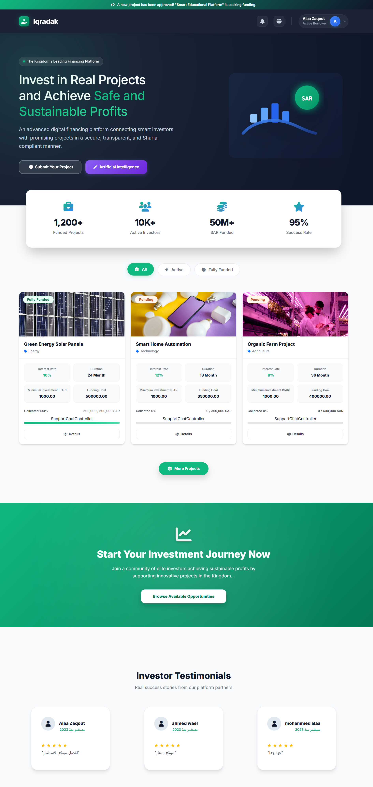

# Iqrad – Smart Lending & Investment Platform

Iqrad is a **web-based smart lending and investment platform** built with **Laravel**.  
It connects **investors** with **borrowers**, enabling transparent, secure, and automated financing while providing full administrative control.

The platform manages the **complete financing lifecycle**, from loan requests and investment funding to repayments and profit distribution.

---

## 🎥 Demo Video

Click the thumbnail to watch the demo:

---

## 🚀 Key Features

- Investor & Borrower registration with role-based access  
- Loan request submission and approval workflow  
- Partial and full investment support  
- Automated installment scheduling and repayment tracking  
- Admin dashboard with real-time insights  
- Email/SMS notifications for approvals and due dates

---

## 👥 User Roles

### 👑 Admin
- Full system control  
- Manage platform settings (interest/profit rates, currencies, fees)  
- Approve or reject loan requests  
- Monitor investments, repayments, and system performance  
- View financial and audit reports

### 💰 Investor
- Register and manage investor profile  
- Browse available investment opportunities  
- Invest in approved loan requests  
- Track investments, expected profits, and repayments  
- View investment history and returns

### 👤 Borrower
- Register and manage borrower profile  
- Submit loan requests with required documents  
- Track loan funding progress and status  
- View installment schedules and repayment history  
- Receive notifications for upcoming payments

> ✅ Users can register as **Investor** or **Borrower** during signup

---

## 🧩 System Modules

- User Registration & Role Selection  
- Borrower & Loan Request Management  
- Investment Management  
- Loan Lifecycle & Repayment Tracking  
- Notifications & Alerts

---

## 📸 Screenshots

### Homepage

---

## 🛠️ Tech Stack

- **Backend:** Laravel (MVC Architecture)  
- **Frontend:** Blade + Livewire or Vue.js  
- **Database:** MySQL  
- **Permissions:** Spatie Laravel Permission  
- **PDF Generation:** DOMPDF  
- **Charts:** Chart.js / ApexCharts

---

## 🔐 Security

- Encrypted sensitive data  
- Hashed passwords  
- Role-based access control  
- Secure financial transactions

---

## 📊 Admin Dashboard Highlights

- 💰 Total invested capital  
- 📊 Active loans and funding progress  
- 💵 Total repayments collected  
- 📉 Defaulted loans overview  
- 📈 Investor profit distribution

---

## 🔮 Future Enhancements

- Online payment gateway integration  
- Mobile application  
- Public REST API

---

## 📌 Project Status

🚧 In Development

---

## 👨‍💻 Author

**Wael Zaqout**  
Laravel Developer

---

⭐ If you like this project, give it a star!
